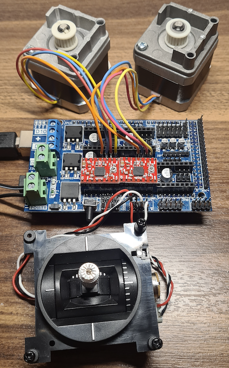

# microscope-controller

Microscope controller project goals are to modify microscope stage in a way that it can be
controlled from manual hand adjustments normally but also with joystick using Mega and RAMPS shield.
Then later Mega code is modified so that host machine applications like Python apps can control stage
X and Y axis automatically due machine vision requirements (microscope has mounted camera).
This requires that microscope needs to be equipped with end stops too.

## RAMPS 1.4 pins

When needed to find quickly where ramps pin is connected at Mega side.

## Build status

### 25.12.2022

### xx.xx.2023
